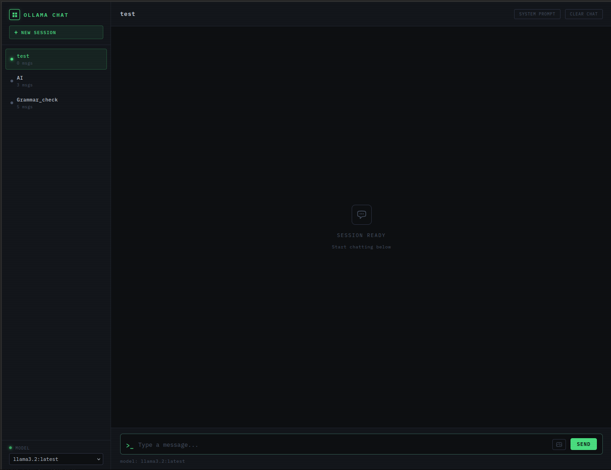
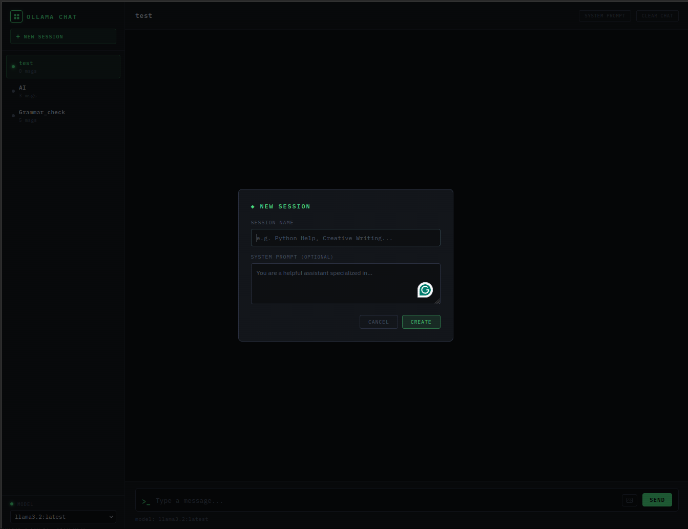

# Chatting with LLM models locally

## Introduction

The goal of this project is to develop a user-friendly GUI for interacting with large language models (LLMs) via the Ollama API in Linux (Ubuntu). The GUI will facilitate model selection, session management, and provide a conversational interface, while also enabling data saving.

## Installation

### 1. Creating Conda environment
```bash
conda create --name ollamaapp python=3.12
conda activate ollamaapp
```
Installing dependencies

```bash
conda env create -f environment.yml
```

### 2. Modifying Ubuntu app

The file called `OllamaChat.desktop` contains the following part that needs to be edited.
```bash
Exec=bash -c "bash $HOME/Documents/research/local_llm/launch.sh"
```
Point the previous line to the path where the `launch.sh` is located.

Make the `launch.sh` file executable as well, and place the `OllamaChat.desktop` file in the `/usr/share/applications/` directory.

Logout and login in Ubuntu.

## Running the application

To launch the application, search for it in the Ubuntu applications menu. Once all prerequisites are met, simply double-click the application icon to initiate the local AI in your browser.

The application will look like:



Creating a new session


At the bottom left of the app you can find the `Model` menu where you can choose the local LLM you want to use for your chat session.

# Testing

Just in case you want to test it out, you can use the following commands:

## environment

```bash
conda activate ollamaapp
```

## Running:
```bash
python app.py
```

# Remarks

Improvements are always welcome, feel free to share your PR. Happy coding!